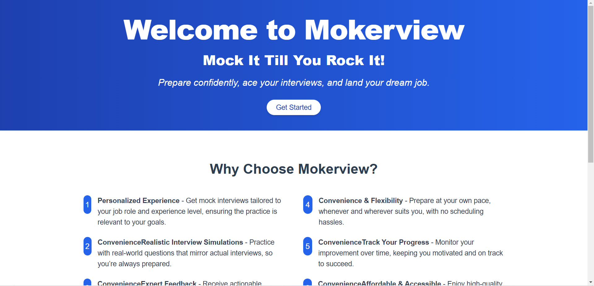
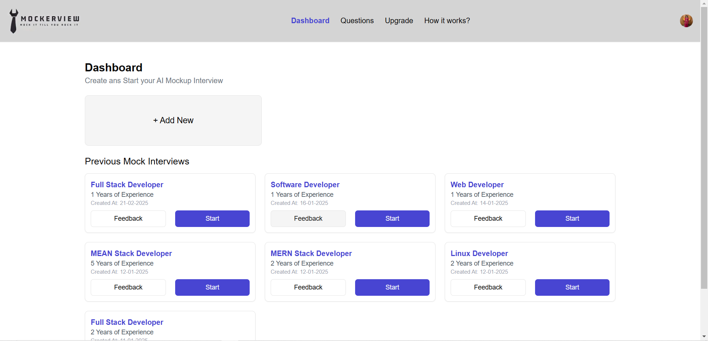
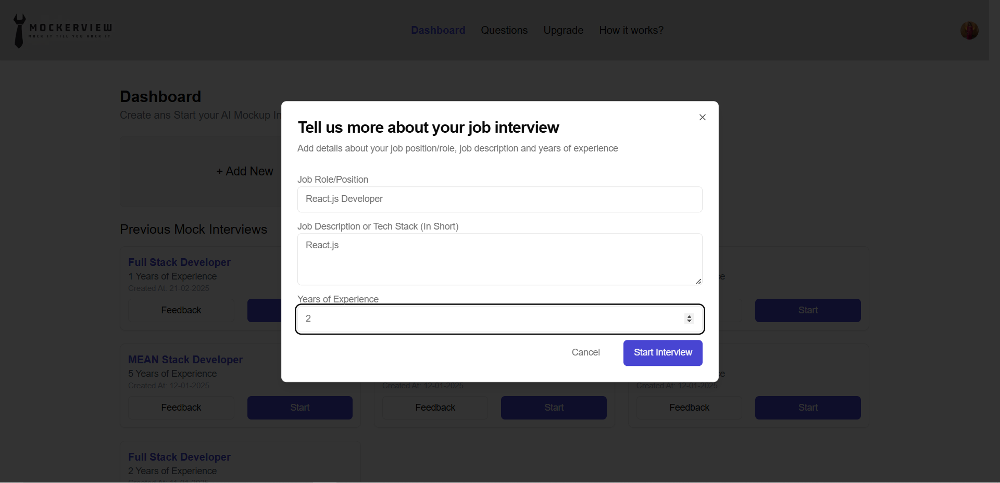
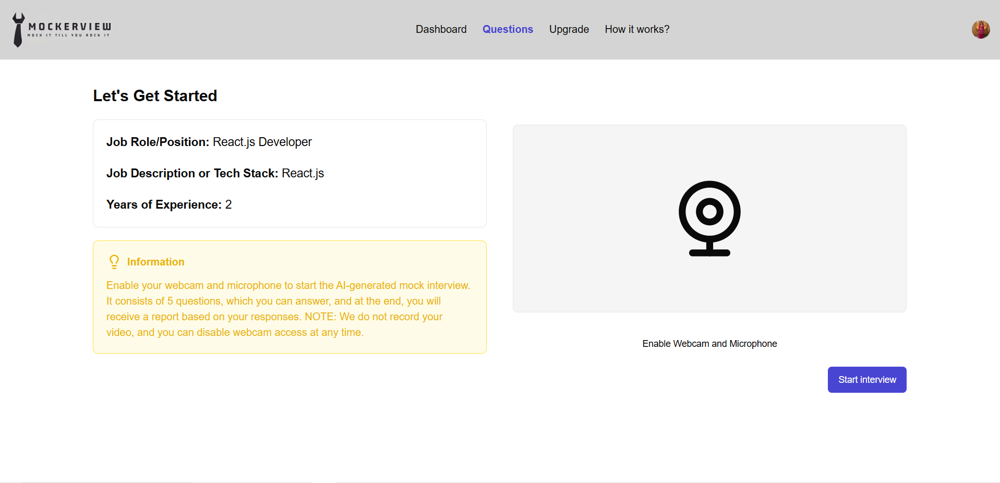
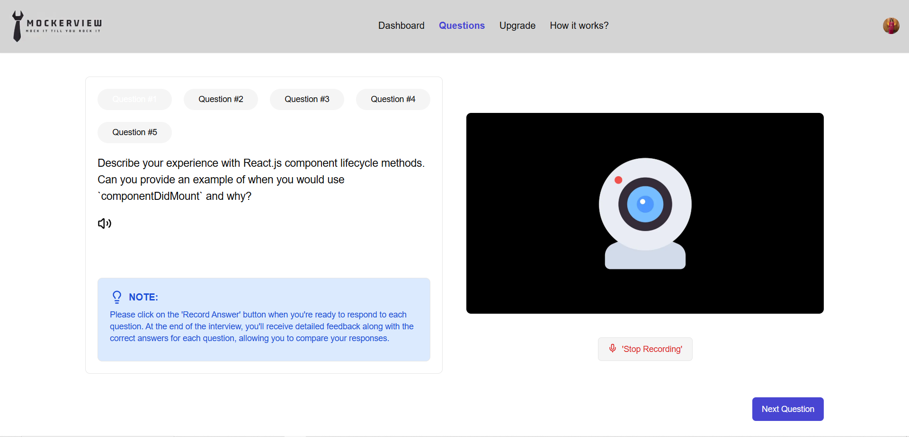
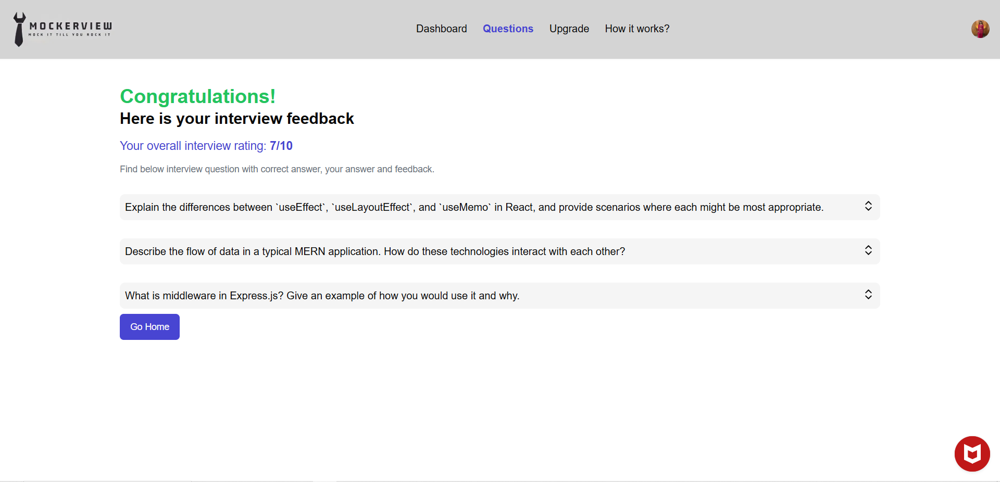
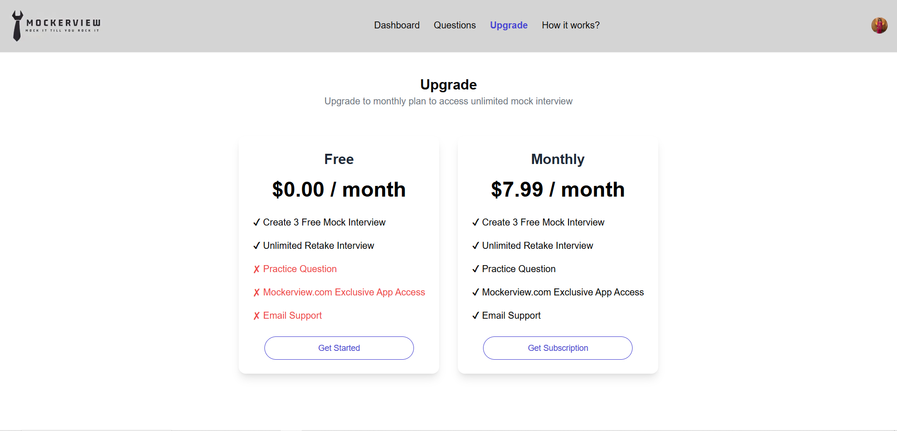
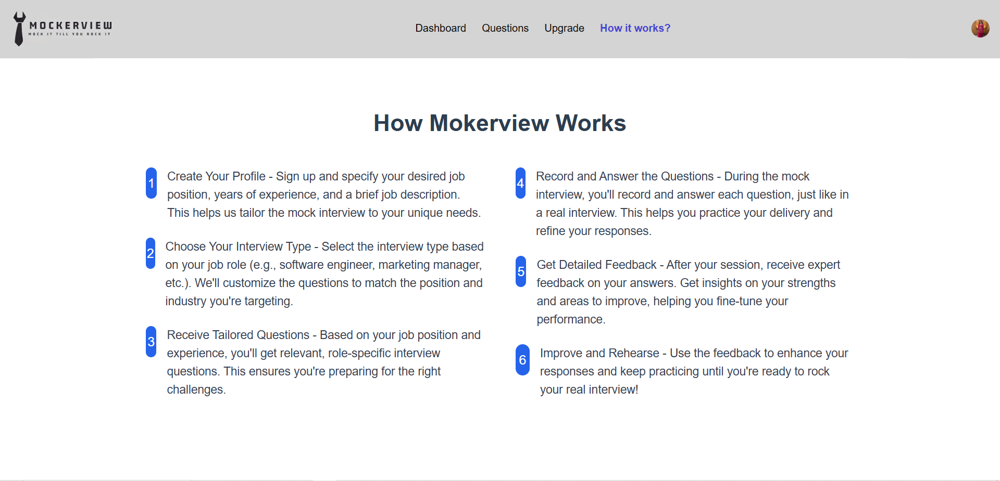

## Overview

AI Interview Mocker is a web application designed to help users prepare for job interviews by providing mock interview sessions. The application generates interview questions based on the user's job position, job description, and years of experience. Users can record their answers, receive feedback, and track their progress.

## Features
- **User Authentication**: Secure user authentication using Clerk.
- **Dashboard**: Users can view the previous mock interviews and start new ones.
- **Mock Interviews**: Generate tailored interview questions and record answers.
- **Feedback**: Receive detailed feedback on answers to improve performance.
- **Upgrade Plans**: Option to upgrade to a monthly plan for additional features.

## API Endpoints
### Dashboard
- **URL:** `/`
- **Method:** GET
- **Description:** Retrieve a list of all previous interviews as well as an option to add a new interview.

### Create Interview
- **URL:** `/dashboard/interview`
- **Method:** POST
- **Description:** Start a new interview. This will create a new interview resource and return the interview ID.

### Feedback
- **URL:** `/dashboard/interview/{id}/feedback`
- **Method:** GET
- **Description:** Get feedback for a specific interview using the interview's unique ID.

### Upgrade Plan Page
- **URL:** `/upgrade`
- **Method:** GET
- **Description:** Retrieve available plans for upgrading to a higher tier.

### How it Works Page
- **URL:** `/how_it_works`
- **Method:** GET
- **Description:** Provides information on how to use the platform.

## UI Structure
The UI consists of the following main components:
- **Get Started:** Information about the platform.


- **Dashboard:** Displays all the previous interviews taken.


- **Create Interview:** A form to set up a new mock interview, where users can provide job position, job description, and experience level.


- **Start Interview:** A page where users can begin answering questions in the mock interview.


- **Questions:** Displays the generated questions for the mock interview session.


- **Feedback:** Displays feedback after the interview is completed.


- **How it works:** Provides a guide on how to use the platform effectively.


- **Upgrade Plan:** Displays available plans for upgrading to higher tiers with additional features.



### Installation
1. Clone the repository:
     ```bash
     git clone https://github.com/yourusername/AI-Interview_Mocker.git
     ```
2. Navigate to the project directory:
     ```bash
     cd AI-Interview_Mocker
     ```
3. Install dependencies:
     ```bash
     npm install
     ```
4. Start the development server:
     ```bash
     npm start
     ```
